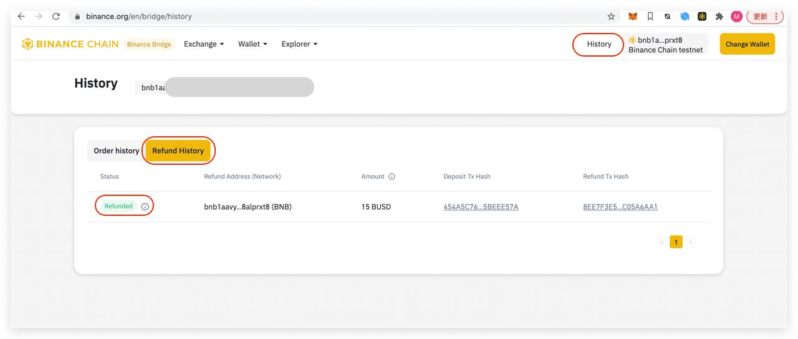

# Binance Bridge History Page

## Order History

List of ststus:

* Completed: The order completed and the assets transferred into the wallet successfully.
* Cancelled: Because of time out user has not received his token but deposit happen
* Failed: transaction does not happen and the token is still in the user's original wallet.
* Waiting for Deposit: transaction does not happen 
* Waiting for Confirmations: transaction is on process _on_ source network
* Remitting: transaction is on process on destination network

## Refund History

  
These records can be included in the following cases:

1. Cancelled swap order

2. Duplicated deposit

3. Deposit to the wrong address by mistake 

List of status:

* Refunded: Assets have been refunded to the user's original wallet
* Refunding: Assets will be refunded to the user's original wallet
* Pending: there is an incoming transaction
* Rejected: Asset cannot be refunded, please contact customer support. 

  

  

