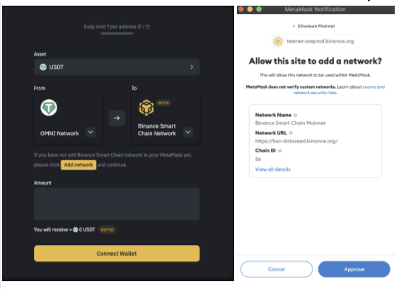

# Binance Bridge V3

Binance Bridge V3 ****is one step further in broadening Binance Bridge’s influence outside of BSC, thus opening up a whole new cross-chain DeFi ecosystem to the community.

## **An Enhanced User Experience \(UX\) and User Interface \(UI\)**

In addition to new pegged assets, one of the core improvements with Binance Bridge V3 is an improved user experience. As with any evolving cross-chain technology, there is a steep learning curve, so marrying various technologies/standards and making it as intuitive as possible for the larger public is a big challenge. A few improvements added are:  

### Add BSC mainnet as a custom network in MetaMask

For MetaMask users, if your wallet has not configured Binance Smart Chain, then the site will add BSC mainnet as a custom network for you.  

### Improved transaction process between BSC & Ethereum network

To avoid mistakes, more restrictions are implemented. 

1. From network must be a user's connected network. For example, if your MetaMask is on Ethereum, then you must send transactions from the Ethereum network. 
2. Destination address must be your connected address. You cannot change the destination address. From now on, you can switch the network to check your balance after completing the swap.

**With these improvements, UI hiccups should be cut down even further to make the cross-chain process as smooth as possible for the everyday user.**  

